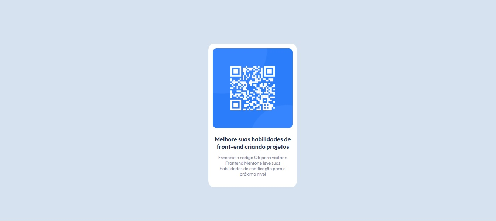
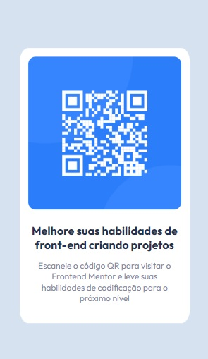

# Frontend Mentor - solução de componente de código QR

Esta é uma solução para o [desafio do componente de código QR no Frontend Mentor](https://www.frontendmentor.io/challenges/qr-code-component-iux_sIO_H). Os desafios do Frontend Mentor ajudam você a melhorar suas habilidades de codificação criando projetos realistas.

## Índice

- [Visão geral]
   - [Captura de tela]
   - [Links]
- [Meu processo]
   - [Construído com]
   - [O que aprendi]
   - [Desenvolvimento contínuo]
   - [Recursos úteis]
- [Autor]
- [Agradecimentos]


## Visão geral

### Captura de tela




### Links

- URL da solução: [https://github.com/negojoseph/QR-code-component/blob/main/index.html](https://github.com/negojoseph/QR-code-component/blob/main/index.html)
- URL do site ao vivo: [https://negojoseph.github.io/QR-code-component/](https://negojoseph.github.io/QR-code-component/)

## Meu processo

### Construído com

- Marcação HTML5 semântica
- Propriedades personalizadas CSS
- Flexbox
- Grade CSS
- Fluxo de trabalho móvel primeiro

### O que eu aprendi


```html
<h1>A<p><strong>Melhore suas habilidades de front-end criando projetos</strong></p></h1>
```
```css
.texto1{
      font-family: 'Outfit', sans-serif;
      font-size: 20px;
      margin: -15px 20px;
      color: hsl(218, 44%, 22%);
    }
```
### Desenvolvimento contínuo

Nesse projeto não tive a chance de trabalhar com #react e #javascript, mas prentendo continuar os estudos em front-end e aprender essas duas linguagens. 

### Recursos úteis

[Outfit](https://fonts.google.com/specimen/Outfit)

## Autor

- Website - [Joseph Monteiro](https://www.youtube.com/channel/UCW547O_z-OVunS10_ilCMSw)
- Frontend Mentor - [@yourusername](https://www.frontendmentor.io/profile/yourusername)
- Instagran - [@prof.josephmonteiro](https://www.instagram.com/prof.josephmonteiro/)


## Agradecimentos

Eu agardeço demais a Deus pela saúde e o dom da vida, e a minha esposa [Leticia Ribeiro](https://www.instagram.com/lett_ribeiros/) por sempre me apoiar em todos os desafios da minha vida.
